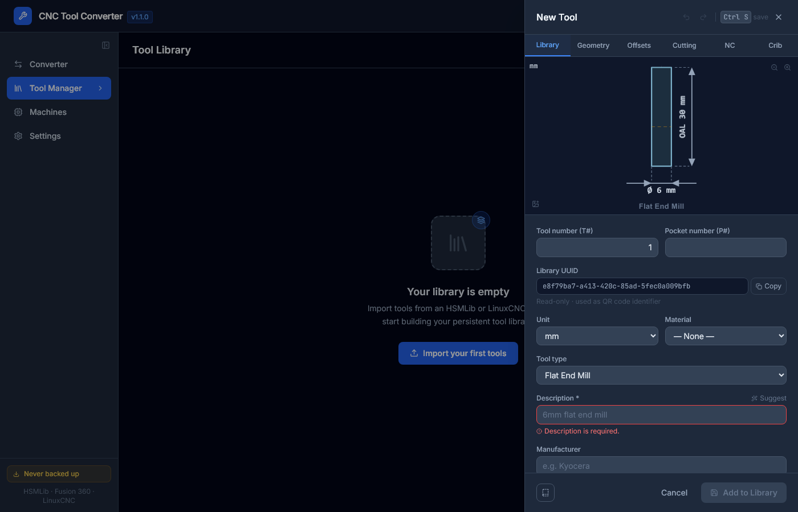
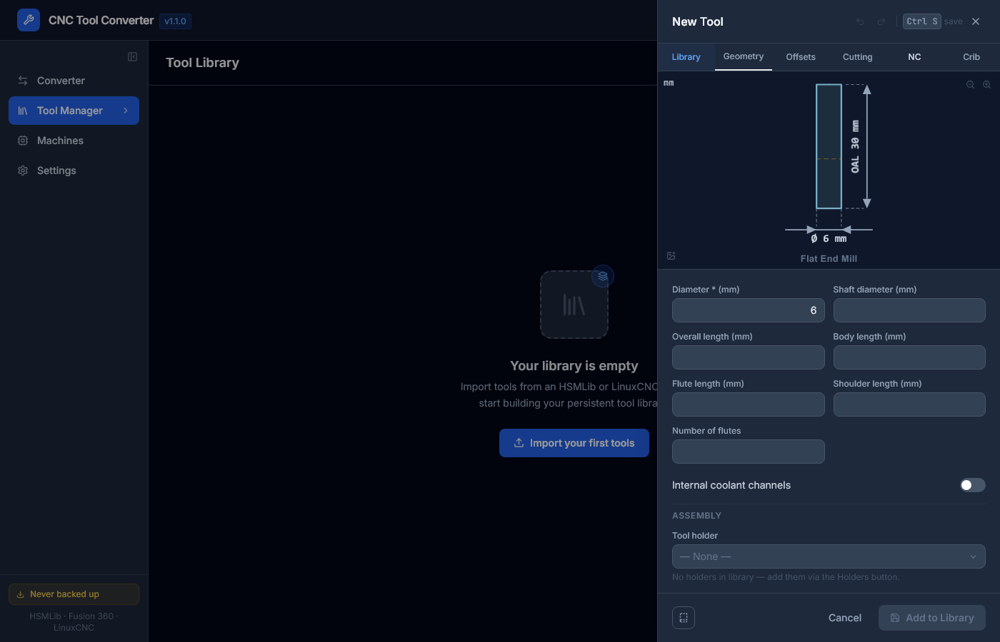
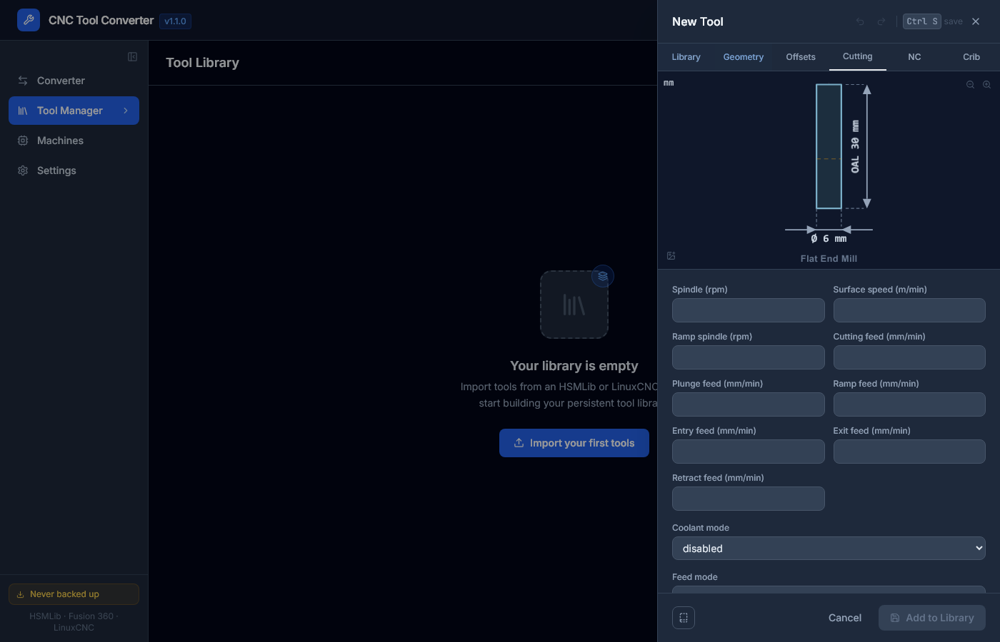
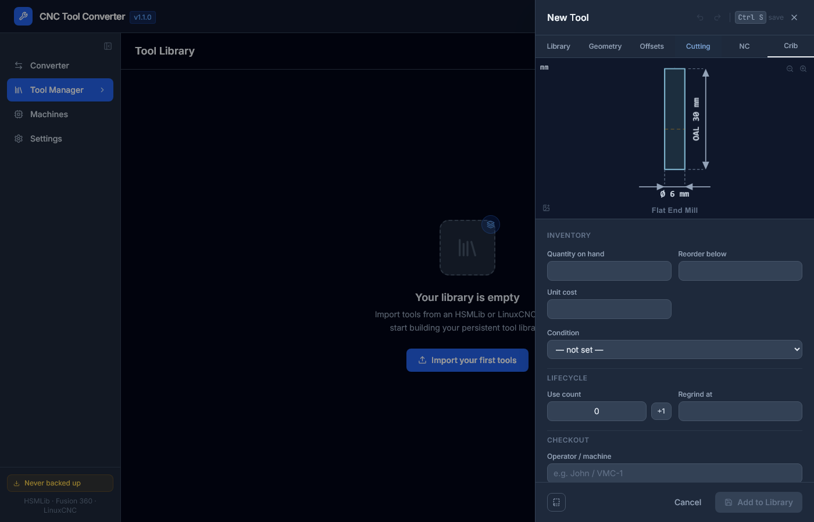

# Editing Tools

## Opening the editor

- **Click any row** in the library table.
- **Focus a row** with `j`/`k` and press `Enter` or `e`.
- Click **New Tool** to create a tool from scratch.

---

## Editor layout

The editor is a slide-over panel on the right side of the screen. It has six tabs:

| Tab | Contents |
|-----|---------|
| **Library** | Tags, machine groups, supplier, location, unit cost, notes, tool image |
| **Geometry** | Type, diameter, shaft dia, OAL, flute length, flutes, corner radius, taper angle, tip dia, thread pitch; live SVG profile preview; holder assignment + stick-out (Assembly section) |
| **Offsets** | Tool offset registers: X, Y, Z, A, B, C, U, V, W |
| **Cutting** | Spindle RPM, all feed rates, feed mode, coolant, clockwise direction; per-material F&S entries |
| **NC** | NC-specific flags: break control, live tool, turret number, manual tool change |
| **Crib** | Lifecycle (use count, regrind threshold), stock history, change log, custom fields |

---

## Live SVG preview

The **Geometry** tab shows a cross-section profile of the tool, rendered in real time as you change values. The profile adapts to tool type — flat end mill, ball end mill, bull nose, drill, chamfer, tap, reamer, boring bar, and more.

When a holder is assigned (Assembly section of the Geometry tab), the profile extends to show the holder shank and bore with an annotated stick-out measurement.

---

## Undo / Redo

The editor maintains a 50-step undo history **per editing session** (i.e. while the panel is open):

| Action | Shortcut |
|--------|---------|
| Undo | `Ctrl+Z` |
| Redo | `Ctrl+Shift+Z` |
| Save | `Ctrl+S` |

Changes are **not saved** until you click **Save** or press `Ctrl+S`. Closing the panel without saving discards the session's changes.

---

## Tool image

In the **Library** tab:

1. Click the image area or drag-drop a photo onto it.
2. The image is resized client-side to ≤ 800 px (JPEG, ~100 KB) and stored in IndexedDB.
3. It appears as a photo strip on the PDF tool sheet.
4. Click **Remove** to delete the image.

---

## Assembly (Geometry tab)

At the bottom of the **Geometry** tab:

1. Search for a holder by name using the search field.
2. Select one — the SVG preview updates to show the combined assembly with stick-out annotation.
3. If the tool's shaft diameter is outside the holder's collet range, an orange warning appears.

---

## Offsets tab

Stores the tool's machine offset registers (X, Y, Z, A, B, C, U, V, W). These are the values written to the machine controller's offset table — distinct from the tool's geometry dimensions.

---

## NC tab

NC-specific flags used by some machine controllers:

| Field | Description |
|-------|-------------|
| **Break control** | Whether the machine should check for tool breakage |
| **Live tool** | Mark as a live (driven) tool (lathe turrets) |
| **Turret** | Turret number assignment |
| **Manual tool change** | Flag that this tool requires a manual change cycle |

---

## Crib tab

### Lifecycle

- **Use count** — shows current count vs regrind threshold. Click **+1** to increment after each use.
- **Regrind threshold** — enter the number of uses before the tool needs regrinding. The progress bar turns amber at 80% and red at 100%.
- The **Uses** column in the library table shows a colour-coded badge when approaching or exceeding threshold.

### Stock history

A timeline of quantity changes for this tool, newest first. Each entry shows the reason (initial / adjustment / manual), the delta (±), and the resulting quantity.

Use the **+ Log entry** form to manually record a stock movement.

### Change log

Every field change made via the editor is logged automatically. Each entry records:

- **Date and time**
- **Operator** (the name set in Settings → Operator)
- **Which fields changed**, with old → new values highlighted

### Custom fields

Add arbitrary key/value metadata. Custom fields can be shown as columns in the library table (Settings → Custom field columns).

---

## Creating from a template

Instead of clicking **New Tool**, click **Templates** in the Libraries ▾ dropdown. The template picker shows all saved templates with type, diameter, and flute count. Click one to open the editor pre-filled with that template's values.

To save a tool as a template: open it in the editor and click **Save as template** in the footer.

---

## Keyboard shortcuts in the editor

| Key | Action |
|-----|--------|
| `Ctrl+S` | Save |
| `Ctrl+Z` | Undo |
| `Ctrl+Shift+Z` | Redo |
| `Esc` | Close (discards unsaved changes) |
