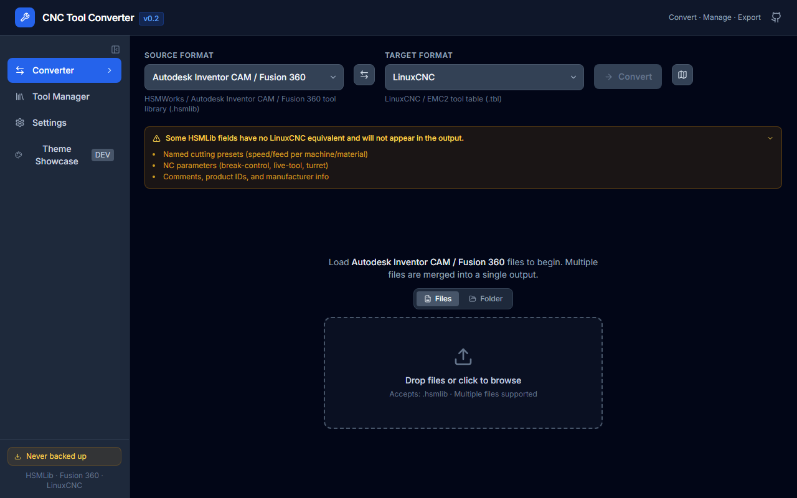
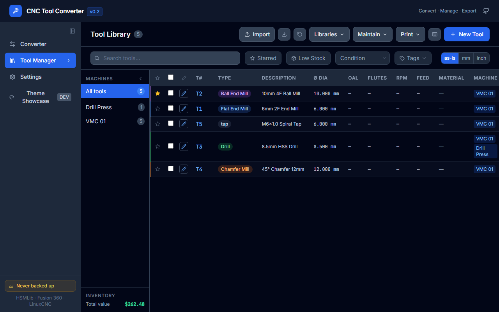

# Getting Started

## Running the app

### Hosted version

If you have a deployed build, simply open the URL in your browser — no installation required.

### Running locally

**Prerequisites:** Node.js 18 or later (includes npm).

```bash
git clone https://github.com/timm052/cnc-tool-converter.git
cd cnc-tool-converter
npm install
npm run dev
```

Open **http://localhost:5173** in your browser.

### Building for production

```bash
npm run build        # outputs to dist/
npm run preview      # serve the production build locally
```

The `dist/` folder is a static site — deploy it on GitHub Pages, Netlify, Cloudflare Pages, or any static host.

---

## First run

When you first open the app you'll see three pages in the left sidebar:

| Page | Purpose |
|------|---------|
| **Converter** | Convert tool library files between formats |
| **Tool Library** | Manage a persistent local library of tools |
| **Settings** | Configure the app |

The sidebar is collapsible — click the **◀ / ▶** arrow at the bottom to toggle it.

---

## Your first conversion

1. Go to the **Converter** page.
2. Select a **Source Format** (e.g. *Autodesk Fusion 360 HSMLib*).
3. Select a **Target Format** (e.g. *LinuxCNC tool table*).
4. Drop a tool library file onto the drop zone.
5. The tools are parsed and shown in the preview table.
6. Click **Convert** — the output appears below.
7. Click **Copy** or **Download** to use the result.



> **Tip:** Enable *Auto-convert on file load* in Settings → Conversion Defaults so step 6 happens automatically.

---

## Your first library entry

1. Go to the **Tool Library** page.
2. Click **New Tool** (top right) — the tool editor opens.
3. Fill in at minimum: **Tool Number**, **Type**, and **Diameter**.
4. Click **Save** (or press `Ctrl+S`).

The tool is now saved permanently in your browser's IndexedDB.

---

## Importing an existing tool library

1. Go to the **Tool Library** page.
2. Click **Import**.
3. Drop a tool library file onto the panel.
4. Review duplicates and click **Import N tools**.

See [Importing Tools](Importing-Tools) for full details.

---

## Data storage

All data is stored in your browser's IndexedDB under the database name `cnc-tool-library`. It persists between sessions and survives browser restarts.

> **Important:** Clearing your browser's site data or using private/incognito mode will delete the library. Use [Snapshots and Backup](Snapshots-and-Backup) to protect your data.

---

## Orientation: toolbar buttons (Tool Library)



| Button | What it does |
|--------|-------------|
| **Import** | Load tools from a file |
| **Export N** | Export selected (or all) tools |
| **Low Stock** | Red — appears when tools are at/below reorder point |
| **Libraries ▾** | Materials, Holders, Templates |
| **Maintain ▾** | Find Duplicates, Renumber, Issues, Scan QR, F&S Wizard, Snapshots |
| **Print ▾** | Tool Sheet, Tool Offsets, Work Offsets, Labels |
| **?** | Keyboard shortcut help |
| **☁** | Remote sync (only visible when a URL is configured in Settings) |
| **New Tool** | Open the editor to create a tool |
