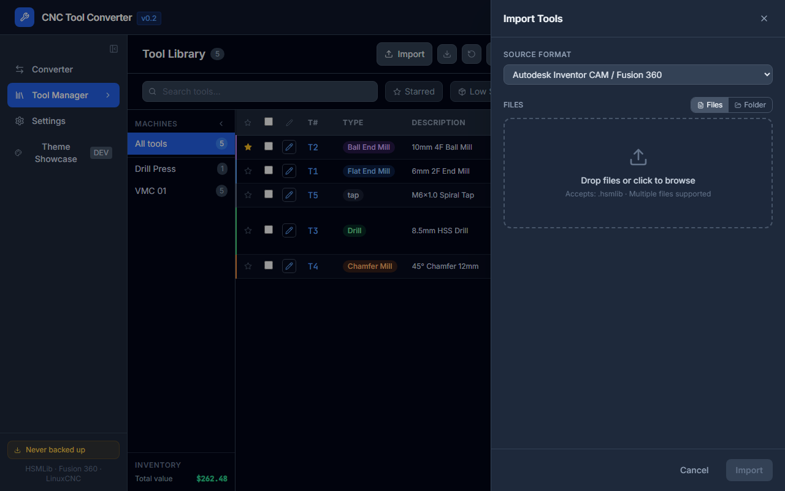

# Importing Tools

Tools can be imported into the library from any supported format file.

---

## Opening the Import panel

Click **Import** in the toolbar on the Tool Library page.

---

## Dropping a file

Drop a tool library file onto the import panel's drop zone, or click the zone to browse. The file is parsed immediately and the results are shown.

**Supported formats:** `.hsmlib`, `.json` (Fusion 360 Cloud / sync backup), `.tbl` / `.tool` (LinuxCNC), `.ofs` (HAAS), `.nc` (Fanuc G10), `.csv` (Mach3 or generic), `.xlsx` (Excel), `.vkb` (RhinoCAM).

---

## The import preview

After parsing, the panel shows:

- **New tools** — tools whose T number doesn't exist in your library (green badge)
- **Duplicate tools** — tools whose T number already exists (amber badge)
- **Validation warnings** — missing required fields, zero diameter, etc.

---

## Handling duplicates

Each duplicate tool has three options:

| Option | What it does |
|--------|-------------|
| **Skip** | Don't import this tool; keep the existing one unchanged |
| **Merge** | Copy selected fields from the incoming tool onto the existing one |
| **Add as new** | Import it as an additional tool (T numbers will collide — use Renumber afterwards) |

### Merging fields

Clicking **Merge** expands a field-diff view showing every field that differs between the incoming and existing tool. Each field has a checkbox — check the ones you want to import. Click **Apply merge** when ready.

---

## Import options

| Option | Description |
|--------|-------------|
| **Default machine group** | Automatically assign imported tools to this group if they have none |
| **Overwrite all duplicates** | Skip the per-tool review and overwrite every duplicate with the incoming version |

---

## Recent files

The last 5 successfully imported file names are shown at the bottom of the import panel for quick re-import.

---

## Importing a backup file (JSON v2)

A `.json` file exported by the **Backup** button (or pushed from a remote sync endpoint) contains tools, materials, and holders in one package. Importing it restores all three.

The backup is compatible with the import panel — drop it like any other file.

---

## Tips

- To bring in tools from another machine's library without touching T numbers, import then use **Copy to Group** rather than reassigning machine groups manually.
- If many tools share the same T number after import, use Maintain ▾ → **Renumber** to resequence them.
- After a large import, run Maintain ▾ → **Issues** to catch missing descriptions, zero diameters, or duplicate T numbers.
