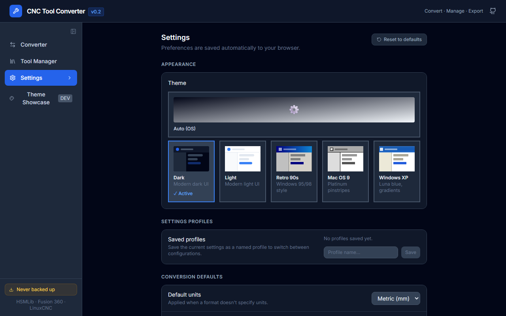

# Settings

Open Settings from the left sidebar (gear icon). Settings are grouped into sections.

---

## Conversion Defaults

| Setting | Description |
|---------|-------------|
| **Auto-convert on file load** | Automatically run the conversion when a file is dropped, without clicking Convert |
| **Remember last format pair** | Restore the last used source → target format combination on page load |
| **Default source format** | The format selected by default when the Converter page first loads |
| **Default target format** | The format selected by default when the Converter page first loads |

---

## File Handling

| Setting | Description |
|---------|-------------|
| **Warn on data loss** | Show a yellow badge on tools where fields will be dropped during export |

---

## Library Defaults

| Setting | Description |
|---------|-------------|
| **Default unit** | mm or inch — used for new tools and as the display default |
| **Default machine group** | Pre-fill the machine group field when creating a new tool |
| **Operator name** | Your name — recorded in each tool's change log and in Remote Sync payloads. Also shown in the sync toolbar as an attribution warning if empty |

---

## Display

| Setting | Description |
|---------|-------------|
| **Theme** | Dark / Light / Retro 90s / Windows XP / Mac OS 9 / Auto (follows OS preference) |
| **Table row density** | Comfortable (45 px rows) or Compact (33 px rows) |
| **Display unit** | Override the display unit in the library table: mm / inch / as stored |
| **Custom field columns** | Choose which custom fields appear as columns in the library table |

---

## Column Visibility

Click **Columns** (column icon in the library table toolbar) to show or hide individual columns. The visibility setting is remembered per browser session.

Columns that can be toggled:

Flute Length, Shaft Diameter, Corner Radius, Taper Angle, Feed Plunge, Coolant, Material, Machine Group, Quantity, Reorder Point, Supplier, Unit Cost, Location, Condition, Uses.

---

## LinuxCNC Writer

| Setting | Description |
|---------|-------------|
| **Decimal places** | Number of decimal places in the output table (1–6) |
| **Pocket assignment** | `match-T` — use T number as pocket; `sequential` — assign pockets 1, 2, 3... |
| **Header comment** | Text to add as a comment at the top of the tool table file |

---

## HSMLib Writer

| Setting | Description |
|---------|-------------|
| **Default machine vendor** | Written into the HSMLib `vendor` field when not specified on the tool |
| **Default machine model** | Written into the HSMLib `model` field when not specified on the tool |

---

## Remote Database

| Setting | Description |
|---------|-------------|
| **Endpoint URL** | Full URL of the remote JSON file or REST API |
| **Auth type** | Bearer token (REST API) or Basic auth (WebDAV/Nextcloud) |
| **Username** | Required for Basic auth; also used as operator attribution in sync payloads |
| **Password / API token** | Secret credential stored in localStorage |
| **Auto-sync on library change** | Automatically push whenever a tool is saved or deleted |

See [Remote Sync](Remote-Sync) for full setup instructions.

---

## Resetting settings

Click **Reset to defaults** at the bottom of the Settings page to restore all settings to their factory values. This does **not** affect your tool library data.
