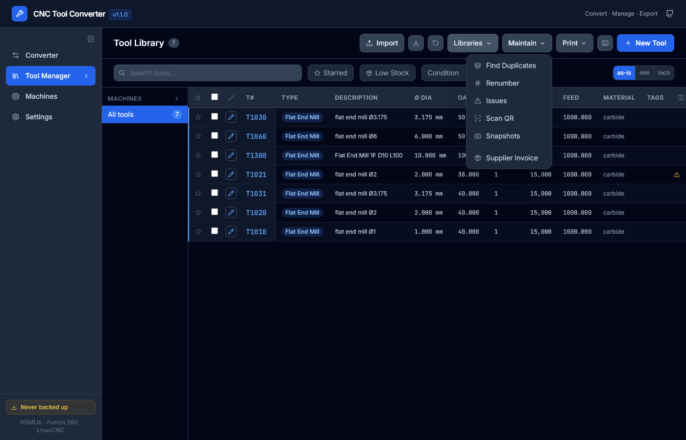
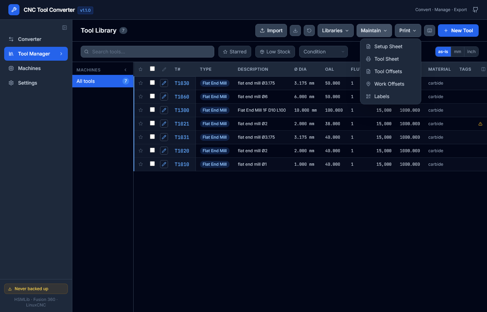
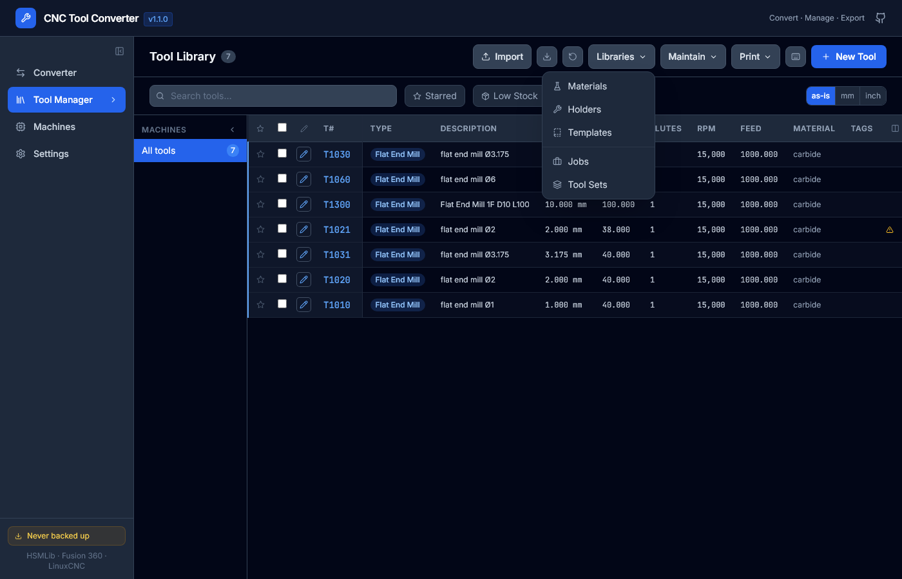

# Tool Library

The **Tool Library** page is the main workspace.

 It holds all your tools in a persistent local database and gives you a full set of management, editing, and export tools.

---

## The library table

Each row is one tool. Columns are configurable — click **Columns** (column icon in toolbar) to show or hide any column. Drag the header to reorder (coming soon).

The **Maintain ▾** dropdown gives access to maintenance tools:



The **Print ▾** dropdown gives access to output options:



The **Libraries ▾** dropdown gives access to Materials, Holders, Templates, Jobs, and Tool Sets:



### Default columns

| Column | Notes |
|--------|-------|
| **T#** | Tool number |
| **Type** | Tool type with colour-coded left border |
| **Description** | Truncated; hover for full text + comment |
| **Diameter** | In the display unit (mm / inch / as-stored) |
| **OAL** | Overall length |
| **Flutes** | Number of cutting edges |
| **RPM** | Spindle speed |
| **Feed** | Cutting feed rate |
| **Tags** | Tag chips; hover a chip to remove it; click `⊞ N` badge to see per-material F&S |
| **★** | Starred / favourite |

### Optional columns (hidden by default)

Flute Length, Shaft Dia, Corner Radius, Taper Angle, Feed Plunge, Coolant, Material, Machine Group, Qty, Reorder Pt, Supplier, Unit Cost, Location, Condition, Uses.

---

## Machine group sidebar

The left sidebar lists all machine groups. Click a group to filter the table to that machine's tools.

- **All** shows the full library.
- The badge on each group shows the tool count.
- The sidebar footer shows total inventory value and low-stock count.
- Click **◀** to collapse the sidebar to an icon strip.

Tools can belong to **multiple** machine groups — they appear under each relevant group.

---

## Search

The search box (🔍 or `/` key) searches across:

- Description
- Type
- Tags
- Manufacturer
- Product ID
- Supplier
- Location

Matches are highlighted. Search is case-insensitive and instant.

---

## Filters

Filter buttons appear to the right of the search box:

| Button | Effect |
|--------|--------|
| **★** | Show only starred tools |
| **Tag ▾** | Filter by one or more tags |
| **Condition ▾** | Filter by condition (New, Good, Worn, etc.) |
| **Low stock** | Show only tools at or below reorder point |
| **mm / inch / as-is** | Override the display unit for all geometry columns |

Filters stack — you can combine machine group + star + tag simultaneously.

---

## Selecting tools

- Click the **checkbox** on a row to select it.
- `Space` toggles selection on the focused row.
- `Ctrl+A` selects all visible (filtered) tools.
- Click the header checkbox to select/deselect all visible.

When tools are selected, additional toolbar buttons appear:

- **N selected ▾** — dropdown with Duplicate, Copy to Group, F&S Calculator, Convert units, Compare
- **Edit N / Bulk Edit** — open the editor for a single tool or bulk edit for multiple
- **Export N** — export the selected tools

---

## Row focus and keyboard navigation

Use `j` / `↓` and `k` / `↑` to move focus between rows without selecting. Press `Enter` or `e` to open the editor for the focused tool.

---

## Table density

Settings → Display → Table row density: **Comfortable** (45 px rows, more whitespace) or **Compact** (33 px rows, more tools visible). The table virtualises rendering either way, so 1 000+ tools scroll smoothly.

---

## Duplicate tool numbers

If two tools have the same T number, a red badge appears in the **T#** column on both. Use Maintain ▾ → **Find Duplicates** (choose *Tool Number* criteria) to review and resolve them.

---

## Inventory value

The machine group sidebar footer shows:

```
Total: £1,234.56   ⚠ 3 low stock
```

This is `Σ(unitCost × quantity)` across all visible tools. The low-stock count is a link to the Low Stock dashboard.

---

## Libraries ▾ contents

| Item | Description |
|------|-------------|
| **Materials** | Work material library (used for per-material F&S data) |
| **Holders** | Tool holder library (used for assembly / stick-out view) |
| **Templates** | Saved tool templates — stamp out new tools with one click |
| **Jobs** | Named job tool lists (BOM sheets); export as PDF or CSV |
| **Tool Sets** | Saved groups of tools — similar to Jobs but lighter weight; reusable named subsets (e.g. "Roughing set", "Finishing set") that can be exported as CSV |

---

## Maintain ▾ contents

| Item | Description |
|------|-------------|
| **Find Duplicates** | Detect tools with duplicate T numbers, descriptions, or diameters |
| **Renumber** | Resequence T numbers with configurable start and step; live before/after preview |
| **Issues** | Validation scanner — finds missing descriptions, zero diameters, low stock, etc. |
| **Scan QR** | Open QR code scanner to look up a tool by its label QR code |
| **F&S Wizard** | 3-step guided cutting-data entry (tool + material → grade + DOC → apply) |
| **Snapshots** | Save and restore point-in-time library snapshots |
| **Supplier Invoice** | Import a supplier delivery note / packing slip CSV to auto-update stock quantities and unit costs |

---

## Print ▾ contents

| Item | Description |
|------|-------------|
| **Setup Sheet** | PDF machine setup sheet: tool list with T#, description, diameter, holder, stick-out, and offset for a selected machine group |
| **Tool Sheet** | Compact multi-column PDF reference card for selected tools |
| **Tool Offsets** | Plain-text `.txt` offset reference card (T#, diameter, Z-offset, flutes, description) |
| **Work Offsets** | G54–G59 work offset reference sheet — dialect-aware (Fanuc / HAAS / Mach3 / LinuxCNC / Siemens); export as `.txt` or `.csv` |
| **Labels** | Printable QR-coded bin labels; configurable size, fields, and QR content |
